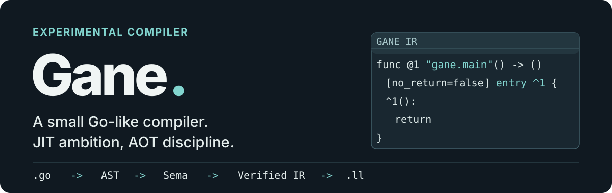

<p align="center">
  
</p>

# Gane

Gane is an **experimental Go-like compiler written in Rust**. It takes a small subset of Go through parsing, semantic analysis, and IR verification, then lowers it to LLVM IR. The project also includes an interpreter for Gane IR, which helps validate the behavior of the compilation pipeline.

> [!IMPORTANT]
> Gane is **not a replacement for the Go compiler**. The current development driver handles one source file at a time and does not support imports, the standard library, or automatic executable linking. A construct being parseable does not mean that it can be compiled. See the [language support document](docs/v0/language-support.md) before trying larger Go programs.

## What it can do

The following program passes the current single-file compilation pipeline:

```go
package main

func add(a int, b int) int {
  return a + b
}

func main() {
  var answer int = add(1000, 24)
  _ = answer
}
```

Gane produces an AST dump, semantic analysis output, verified Gane IR, and LLVM IR. A fragment of the generated IR looks like this:

```text
target <spec> { ... }
type !1 = void
type !2 = i1
type !3 = i8
type !4 = i16
type !5 = i32
type !6 = i64
type !7 = ptr(addrspace=0, !6)
func @1 "gane.add"(!6, !6) -> (!6) [no_return=false] entry ^1 {
  slot $1: !6
  slot $2: !6
  ^1(%1: !6, %2: !6):
    %3 = stack_addr $1
    store %3, %1
    %4 = stack_addr $2
    store %4, %2
    %5 = load %3
    %6 = load %4
    %7 = add %5, %6
    return %7
}
func @2 "gane.main"() -> () [no_return=false] entry ^1 {
  slot $1: !6
  ^1():
    %1 = const !6 1000
    %2 = const !6 24
    %3 = call @1(%1, %2)
    %4 = stack_addr $1
    store %4, %3
    %5 = load %4
    return
}
entry @2
```

## Quick start

You need a Rust toolchain and **LLVM 22.1.x**, including `llvm-config` and `libLLVM`. The workspace uses Inkwell with the `llvm22-1` feature. On macOS, LLVM can be installed with Homebrew:

```sh
brew install llvm@22
export LLVM_SYS_221_PREFIX="$(brew --prefix llvm@22)"
```

Save the Go example above as `example.go`, then run this command from the repository root:

```sh
cargo run -p gane_driver -- single example.go --out-dir out
```

A successful run writes the following files to `out/`:

```text
example.go.ast.txt    # Parsed AST
example.go.sema.txt   # Semantic analysis result
example.go.ir.txt     # Verified Gane IR
example.go.ll         # LLVM IR verified by LLVM
```

The driver also runs the interpreter. A runtime trap is reported as a failed execution. The `.ll` file is generated output; the driver does not automatically link or execute it. 

On other systems, install a matching LLVM 22.1.x distribution and set `LLVM_SYS_221_PREFIX` to its installation directory, which must contain `bin/llvm-config`.

## Current scope

- **Types and data**: `bool`, `int`, `byte`, pointers, fixed-size arrays, non-empty structs, and a limited form of named types.
- **Expressions and control flow**: limited integer operations and comparisons, field and array access, direct function calls, `if`, three-clause and loop `for`, assignment, and return statements.
- **Compilation pipeline**:
  ```mermaid
  flowchart LR
    A[Lexer/Parser] --> B[Semantic Analysis]
    B --> C[Gane IR Lowering and Verification]
    C --> D[Gane IR Interpreter]
    C --> E[LLVM IR Code Generator]
  ```
- **Not supported**: multi-file CLI compilation, imports, strings, floating-point values, slices, maps, interfaces, methods, goroutines, channels, the Go standard library, garbage collection, automatic linking and so on.

See the [M0 language support document](docs/v0/language-support.md) for more information.

## Repository structure

```text
crates/
├─ parser/        Go-like source -> AST
├─ diagnostics/   Source positions and diagnostics
├─ sema/          Name, type, and scope analysis
├─ ir/            Lowering and IR verification
├─ interpreter/   Execution of verified IR
├─ codegen/       Verified IR -> LLVM IR
└─ driver/        Single-file development driver

docs/             Language scope and design documents
tests/testdata/   Source inputs used by compiler-pipeline tests
```

## Development and testing

After setting `LLVM_SYS_221_PREFIX`, run the following commands from the repository root:

```sh
cargo fmt --check
cargo check --workspace
cargo test --workspace
cargo clippy --workspace --all-targets --all-features -- -D warnings
```

## License

Gane's original code is licensed under the [Apache License, Version 2.0](LICENSE).

Parts of `crates/parser` are derived from the Go standard library and remain subject to the BSD-style license used by the Go project. See [NOTICE](NOTICE) for attribution and the full license text.
