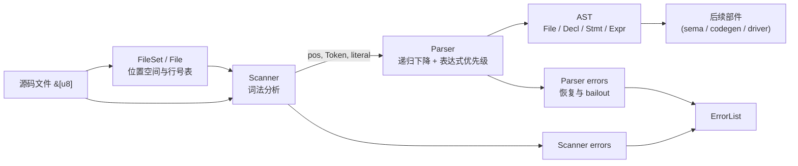
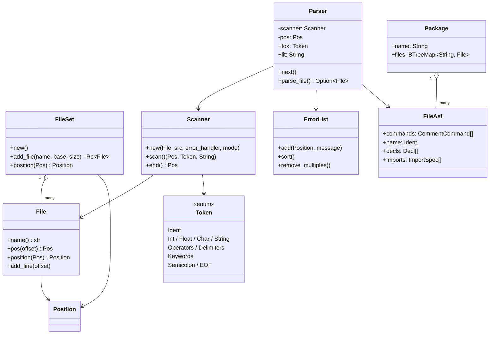
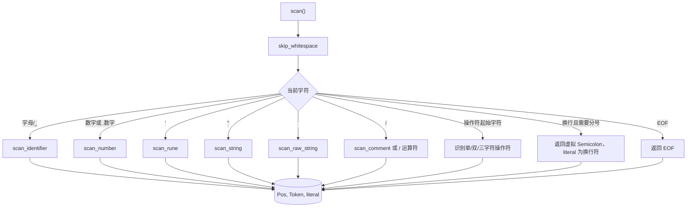
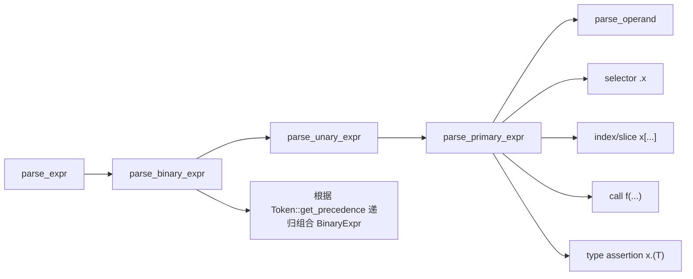
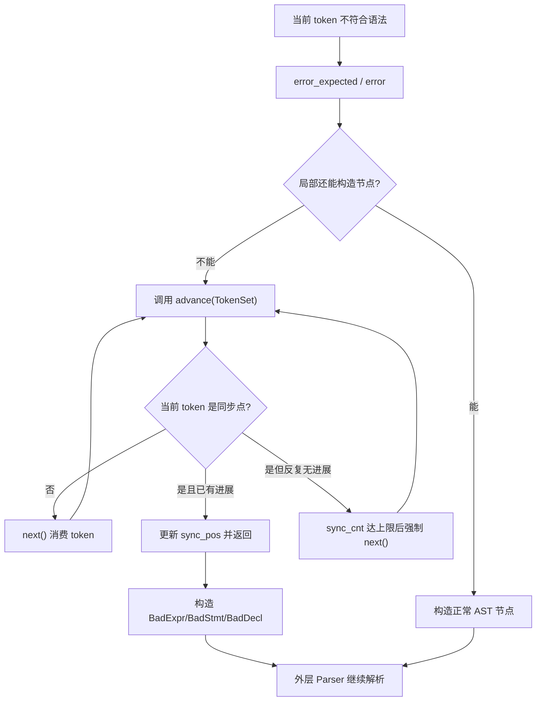
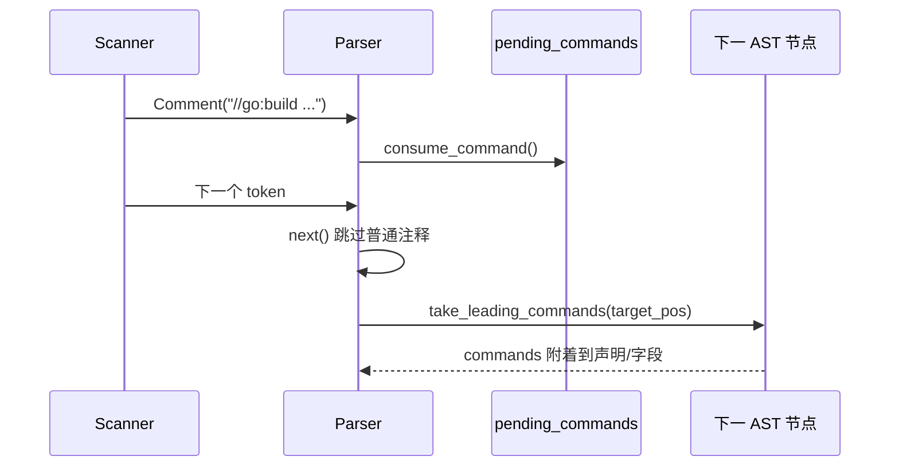
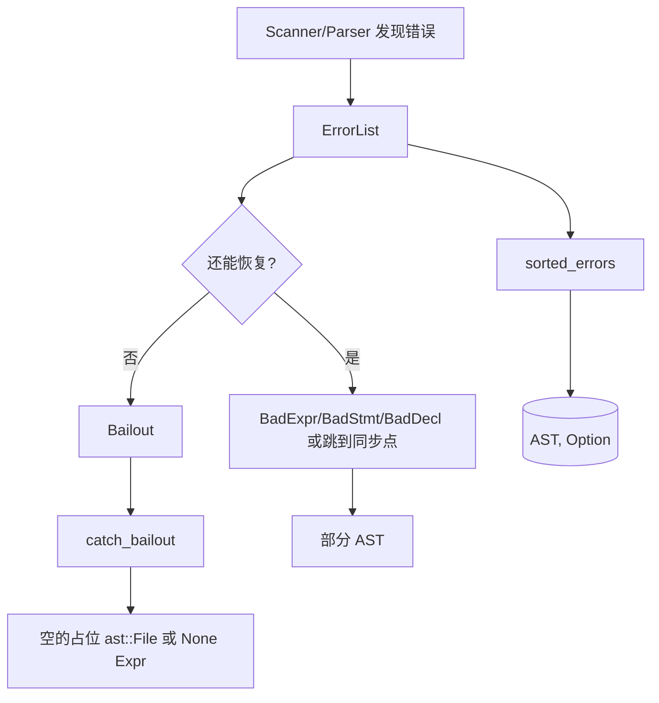

# `gane_parser` 总揽

本文对应作者自己设计的go语言编辑器gane中的`crates/parser`。它是一个参考 Go 标准库 `go/token`、`go/scanner`、`go/ast`、`go/parser` 移植而来的 Go 源码解析器。

一句话概括：

> 原始字节 `&[u8]` 先由 `Scanner` 识别为带位置的 `Token`，再由 `Parser` 按语法规则消费 token，构造 `ast` 中的语法树；错误和位置信息贯穿整个过程。

## 1. 先建立整体模型



源码在解析过程中有两条并行信息流：

1. **语法流**：源代码文件字节 -> token -> AST 节点。
2. **诊断流**：字节偏移 -> `Pos` -> `Position(file, line, column)`，同时收集词法和语法错误。

`parser` 只负责语法结构，不负责名称绑定、类型检查或生成代码。后续 `sema` 才会消费 AST 做语义分析。

## 2. 组织架构

| 模块 | 主要职责 | 对外可见内容 |
|---|---|---|
| `token/position.rs` | 管理文件、偏移、行列号和 `//line` 映射 | `Pos`、`Position`、`File`、`FileSet` |
| `token/token.rs` | 定义 token 种类、关键字、操作符和优先级 | `Token` |
| `scanner/scanner.rs` | 逐字符读取源码并进行词法分析 | `Scanner` |
| `scanner/error.rs` | 统一保存、排序和格式化错误 | `Error`、`ErrorList` |
| `ast/ast.rs` | 定义解析结果的语法树节点 | `File`、`Package`、`Decl`、`Stmt`、`Expr`、`Spec` |
| `ast/directive.rs` | 解析 `//tool:name args` 形式的指令注释 | `Directive`、`parse_directive` |
| `ast/walk.rs` | 遍历 AST | `NodeRef`、`inspect`、`preorder` |
| `ast/strconv.rs` | 为指令参数提供 Go 字符串反引号/双引号解码 | crate 内部 `unquote` |
| `parser/interface.rs` | 对外 API、目录聚合、错误 bailout 边界 | `parse_file`、`parse_expr` |
| `parser/parser.rs` | 真正的递归下降语法分析器 | crate 内部 `Parser` |

模块导出关系如下：



## 3. 位置系统

### `Pos`：紧凑的内部位置

`Pos` 是一个封装后的整数。对某个文件而言：

```text
Pos = File.base + source_byte_offset
```

`NO_POS = 0` 表示无效位置。`FileSet` 给每个文件分配不重叠的整数区间，所以多个文件的 AST 节点可以直接携带同一种 `Pos`。

### `Position`：给人看的位置

`Position` 包含：

```text
file_name, offset, line, column
```

`File` 内部维护行首偏移表。Scanner 每遇到换行就调用 `file.add_line`，之后 `FileSet.position(pos)` 才能把位置转换成 `file.go:line:column`。

`add_line_info` / `add_line_column_info` 用于处理 `//line` 指令：原始偏移不变，但诊断显示的文件名、行号或列号可以被重映射。错误排序按文件名、行、列和消息排序，而不是简单按 `Pos` 排序。

## 4. Token

`Token` 分为几组：

- 特殊：`Illegal`、`EOF`、`Comment`。
- 字面量：`Ident`、`Int`、`Float`、`Imag`、`Char`、`String`。
- 运算符与分隔符：`+`、`:=`、`==`、`(`、`{`、`;` 等。
- 关键字：`package`、`func`、`if`、`type`、`var` 等。
- 额外 token：`Tilde`，用于类型集合等语法。

对于标识符，Scanner 会先读出文本，再通过 `Token::lookup` 把关键字转为对应 token；普通名称仍然是 `Ident`。Parser 通过 `tok` 判断语法，通过 `lit` 取得原始字面量文本。

操作符还提供 `get_precedence()`：`||` 最低，接着是 `&&`、比较、加减、乘除/位运算。Parser 的 `parse_binary_expr` 用它实现表达式结合和优先级。

## 5. Scanner

### 内部状态

Scanner 持有源码切片、当前字符 `ch`、当前偏移 `offset`、下一次读取位置 `rd_offset`、当前行首 `line_offset` 和自动插入分号状态 `insert_semi`。

主要步骤是：



### Scanner 的几个关键行为

1. **UTF-8 与 BOM**：允许文件开头 BOM；非法 UTF-8、文件中间的 BOM、NUL 会报告错误。
2. **数字**：识别整数、浮点数、虚数，并检查进制、下划线和非法数字格式。
3. **字符串/字符**：保留源码形式作为 literal；Scanner 主要负责边界和合法性，AST 的 `BasicLit.value` 仍然包含引号。
4. **注释**：以 `SCAN_COMMENTS` 模式返回 `Comment`，这样 Parser 可以从注释中提取 `//go:` 和 `//gane:`；与 `go/parser` 不同，由于并不需要处理文档生成相关的工作，本编译器中普通注释随后被 Parser 丢弃。
5. **自动分号**：根据 Go 规则在行尾或注释换行处产生 synthetic `Semicolon`。Parser 可以通过 `lit == "\\n"` 判断它是隐式分号。
6. **行信息**：扫描换行时把行首加入 `File` 的行表，因此 token 的位置可以立即转换为行列号。

## 6. Parser

### Parser 的状态

`Parser` 内部持有：

- `scanner`：token 来源；
- `pos`、`tok`、`lit`：当前 token 的位置、类别和文本；
- `imports`：解析过程中收集的导入；
- `pending_commands`：遇到的、尚未附着到目标 AST 节点的命令注释；
- `errors`：Scanner 和 Parser 共用的 `ErrorList`；
- `sync_pos`、`sync_cnt`：错误恢复时防止无限推进；
- `nest_lev`：递归深度保护，避免恶意输入耗尽 Rust 线程栈。

初始化时 `Parser::new` 会创建错误回调、初始化 Scanner，并立即调用一次 `next()`，因此 Parser 创建完成后已经拥有第一个非注释 token。

### `next`、`next0` 与 `advance`

- `next0()`：从 Scanner 取一次 `(pos, tok, lit)`。
- `next()`：反复调用 `next0()` 跳过普通注释，同时把 `//go:` / `//gane:` 放入 `pending_commands`。
- `advance(TokenSet)`：错误恢复用。不断推进直到 token 属于同步集合，或者确认无法继续。
- `expect(tok)` / `expect2(tok)` / `expect_semi()`：检查当前 token，不符合时记录错误并尽量继续。

这解释了 Parser 的典型循环：检查当前 `tok` → 构造节点 → `next()` 消费输入 → 返回父节点。

### 语法函数的分层

| 层级 | 代表函数 | 产物 |
|---|---|---|
| 基础 | `parse_ident`、`parse_type`、`parse_field_decl` | 标识符、类型、字段 |
| 类型 | `parse_array_type`、`parse_struct_type`、`parse_interface_type`、`parse_func_type`、`parse_map_type`、`parse_chan_type` | `Expr` 中的类型节点 |
| 表达式 | `parse_operand`、`parse_primary_expr`、`parse_unary_expr`、`parse_binary_expr` | `Expr` |
| 语句 | `parse_simple_stmt`、`parse_if_stmt`、`parse_for_stmt`、`parse_switch_stmt`、`parse_select_stmt` | `Stmt` |
| 声明 | `parse_import_spec`、`parse_value_spec`、`parse_type_spec`、`parse_func_decl` | `Spec` / `Decl` |
| 文件 | `parse_file` | `ast::File` |

表达式大致按以下方向构造：



例如 `a + b*c` 的构造不是线性列表，而是：

```text
BinaryExpr(
  x = Ident("a"), 
  op = +,
  y = BinaryExpr(
  	x = Ident("b"), 
  	op = *, 
  	y = Ident("c"))
)
```

### 错误恢复

> 上面提到了`parser`通过`advance(TokenSet)`来前往下一个集合同步点来进行错误恢复，我觉得这个地方的设计十分巧妙，我觉得可以单独讲讲。

当前的项目的错误恢复主要由三个部分组成：

1. `error()`：记录并限制错误数量
2. `advance()`：跳过无法解析的 token，寻找同步点。
3. `BadExpr` / `BadStmt` / `BadDecl`：保留一个“错误占位节点”，让 Parser能继续构造部分的 AST

#### 1. advance 的核心实现

```rust
type TokenSet = fn(Token) -> bool;

fn advance(&mut self, to: TokenSet) {
    while self.tok != Token::EOF {
        if to(self.tok) {
            if self.pos == self.sync_pos && self.sync_cnt < 10 {
                self.sync_cnt += 1;
                return;
            }

            if self.pos > self.sync_pos {
                self.sync_pos = self.pos;
                self.sync_cnt = 0;
                return;
            }

            // 同一个位置重复恢复超过限制，继续消费当前 token。
        }
        self.next();
    }
}
```

伪代码：

```plaintext
while 当前 token 不是 EOF:
    如果当前 token 是同步点:
        如果相对于上次同步位置没有前进:
            前 10 次允许暂时返回
        如果已经前进到更后面:
            更新同步位置
            返回
        如果一直没有进展:
            强制消费当前 token
    否则:
        消费当前 token，继续向后寻找
```

#### 2. 什么是同步点

同步点不是一个固定的 Token，而是一个由调用者传入的一个 token 集合函数：
项目中规定了几个同步集合：

1. `fn stmt_start(tok: Token) -> bool`：指可能开始一条语句的 token

   ```rust
   fn stmt_start(tok: Token) -> bool {
       matches!(
           tok,
           Token::Break
               | Token::Const
               | Token::Continue
               | Token::Defer
               | Token::FallThrough
               | Token::For
               | Token::Go
               | Token::Goto
               | Token::If
               | Token::Return
               | Token::Select
               | Token::Switch
               | Token::Type
               | Token::Var
       )
   }
   ```

2. `fn decl_start(tok: Token) -> bool`：表示可能开始声明的 token

   ```rust
   fn decl_start(tok: Token) -> bool {
       matches!(tok, Token::Import | Token::Const | Token::Type | Token::Var)
   }
   ```

3. `fn expr_end(tok: Token) -> bool`：表示表达式可能结束的位置

   ```rust
   fn expr_end(tok: Token) -> bool {
       matches!(
           tok,
           Token::Comma
               | Token::Colon
               | Token::Semicolon
               | Token::RParen
               | Token::RBrack
               | Token::RBrace
       )
   }
   ```

因此，advance 的行为取决于调用场景。

#### 3. `advance` 是如何一路向后推进的

假设源码类似：

```go
func main() {
  x = + * * ;
  return
}
```

假设 Parser 在解析 x 右侧表达式时遇到了无法识别的内容。当前的 TokenStream 可以简化为：

```text
x = + * * ; return } EOF
```

当 Parser 发现不符合预期之后，`parse_operand` 会先报告错误，再调用：

```rust
let pos = self.pos;
self.error_expected(pos, "operand");
self.advance(stmt_start);

Expr::BadExpr(BadExpr {
    from: pos,
    to: self.pos,
})
```

这里传入 `stmt_start`，表示本次恢复的目标是“下一条可能开始的语句”。`advance` 会依次检查当前 token：

```text
当前 token       是否是 stmt_start       操作
------------------------------------------------
+                否                     next()
*                否                     next()
*                否                     next()
;                否                     next()
return           是                     停止并返回
```

因此恢复完成后，Parser 的当前 token 是 `return`，而错误表达式被记录为一个 `BadExpr`，范围大致是从错误起点到 `return` 之前。外层解析器随后可以继续解析 `return`，得到类似这样的部分 AST：

```text
BlockStmt
├── 包含 BadExpr 的错误语句
└── ReturnStmt
```

`advance` 不负责修复错误内容，它只负责把 Parser 放回一个较可靠的语法边界；具体的错误区域由调用者用 `Bad*` 节点记录。

#### 4. `sync_pos` 和 `sync_cnt` 如何避免死循环

如果只实现成“遇到同步 token 就返回”，多个嵌套解析函数可能在同一个 token 上重复调用 `advance`：

```text
parse_stmt
└── parse_simple_stmt
    └── parse_expr
        └── parse_operand
```

它们可能都发现当前 token 不符合自己的预期。如果每一层都在同一个位置返回，Parser 就可能永远停在这个 token 上。

因此 Parser 维护：

```rust
sync_pos: Pos, // 最近一次同步的位置
sync_cnt: i32, // 在同一同步位置上重复返回的次数
```

遇到同步 token 时，`advance` 有三种情况：

1. **到达新的位置**：`self.pos > self.sync_pos`。更新 `sync_pos`，重置 `sync_cnt`，返回。
2. **仍在相同位置但次数未超限**：`self.pos == self.sync_pos && self.sync_cnt < 10`。增加 `sync_cnt` 后返回，让外层函数处理当前同步 token。
3. **相同位置重复超过 10 次**：不再返回，执行 `self.next()`，强制消费当前 token，打破潜在死循环。

所以同步点本身不一定由 `advance` 消费；但如果多个恢复路径长期无法让位置变化，`sync_cnt` 会强制 Parser 向后推进。

#### 5. 不同上下文使用不同同步集合

`advance` 不是全局的“跳到下一个分号”，而是由调用者根据当前语法层次选择恢复边界：

| 调用场景 | 同步集合 | 恢复目标 |
|---|---|---|
| `parse_type`、字段或类型参数解析 | `expr_end` | 逗号、冒号、分号或右括号等表达式/类型边界 |
| `parse_operand`、语句解析 | `stmt_start` | 下一条可能开始的语句 |
| `parse_decl` | 调用者传入的 `sync` | 下一条可能开始的声明或外层边界 |
| `expect_semi` | `stmt_start` | 分号缺失时跳到后续语句 |

#### 6. `expect` 和 `advance` 的区别

- `expect(Token::RParen)`：Parser 确定这里应该出现一个具体 token。即使当前 token 不匹配，也只消费当前 token 后继续。
- `advance(expr_end)`：当前局部结构已经无法按正常规则解析，需要跳过一段不确定长度的 token，直到到达恢复边界。

前者是“单 token 容错”，后者是“区间级恢复”。

#### 7. 从错误到最终返回值



最终 `parse_file` 仍然可能返回包含 `Bad*` 节点的 `ast::File`，同时通过 `Option<ErrorList>` 返回错误。只有在初始 token 或 package 子句都无法继续，或者触发错误数量/嵌套深度 bailout 时，才会返回空的占位 File。

## 7. AST：解析结果如何组织

### 文件和包

```text
Package
└── files: BTreeMap<filename, ast::File>
    ├── commands: Vec<CommentCommand>
    ├── name: Ident
    ├── imports: Vec<ImportSpec>
    └── decls: Vec<Decl>
```

`ast::File` 记录包名位置、文件整体起止位置、顶层声明和导入。

### 四个分类 enum

Rust 没有 Go 的接口和 type switch，因此源码把节点分成四个 enum：

| enum | 包含内容 |
|---|---|
| `Expr` | 标识符、字面量、调用、选择器、二元/一元表达式，以及数组/结构体/函数/接口/map/channel 类型 |
| `Stmt` | 表达式语句、赋值、声明、return、if、for、switch、select、go、defer 等 |
| `Spec` | `ImportSpec`、`ValueSpec`、`TypeSpec` |
| `Decl` | `GenDecl`、`FuncDecl`、错误占位 `BadDecl` |

每种具体节点都实现 `pos()` / `end()`，父节点通常通过子节点计算范围。解析出错时会使用 `BadExpr`、`BadStmt`、`BadDecl`，所以“有错误”不一定意味着没有 AST。

### AST 遍历

`ast/walk.rs` 提供 `NodeRef`，它是对所有 AST 节点的借用视图。`inspect` 是递归深度优先遍历，`preorder` / `preorder_stack` 是前序迭代器。它们只读取 AST，不重新解析源码。

## 8. 注释和指令是怎样流动的

普通注释不会进入 AST。Parser 只保留两类命令注释：`//go:...` 和 `//gane:...`。



有两个细节容易误解：

- 同一行尾部的命令注释不算“紧邻前方节点的 leading command”；
- 文件头命令使用 `take_file_commands()`，允许命令块和 `package` 之间存在空行，典型例子是 `//go:build`。

`ast::directive::parse_directive` 是更通用的 `//tool:name args` 解析器，负责拆出 `tool`、`name`、`args` 和参数位置；它和 Parser 的命令注释保留逻辑是相关工具，但不是每个普通注释都会自动变成 `Directive`。

## 9. 错误处理和部分 AST

错误来源有两类：

1. **Scanner 错误**：非法字符、非法 UTF-8、数字/字符串/注释格式错误等，通过 `ErrorHandler` 写入共享 `ErrorList`。
2. **Parser 错误**：缺少 token、语法不匹配、声明顺序错误等，由 `Parser::error` 写入同一个列表。

Parser 会尝试恢复：使用同步 token 集继续向后扫描，必要时创建 `Bad*` 节点。默认模式下还会抑制同一行的重复错误，并在超过一定数量后触发内部 `Bailout`，避免错误恢复进入死循环或产生大量级联错误。

`interface.rs` 的 `catch_bailout` 把内部 panic marker 转换为普通返回结果；其他非 `Bailout` panic 会重新抛出。`parse_file` 最终保证返回一个 `ast::File`：完全无法开始解析时会构造空的占位 File，同时返回错误列表。



## 10. 三个对外入口的完整数据流

### `parse_file`

```text
FileSet::add_file(filename, -1, src.len())
  → Parser::new(file, src, mode)
  → Scanner::new(..., SCAN_COMMENTS)
  → Parser::parse_file()
      → package clause
      → import declarations
      → remaining top-level declarations
  → 设置 file_start / file_end
  → 错误排序
  → (ast::File, Option<ErrorList>)
```

模式位：

- `PACKAGE_CLAUSE_ONLY`：只解析到 package 子句；
- `IMPORTS_ONLY`：解析 package 和 imports 后停止；
- `DECLARATION_ERRORS`：报告更多声明相关错误；
- `ALL_ERRORS` / `SPURIOUS_ERRORS`：减少默认错误抑制。

### `parse_expr_from` / `parse_expr`

入口建立临时或调用方提供的 `FileSet`，解析一个表达式，接受隐式分号后要求最终 token 是 `EOF`。返回 `(Option<Expr>, Option<ErrorList>)`。`parse_expr` 只是使用空文件名和新 `FileSet` 的便捷包装。
