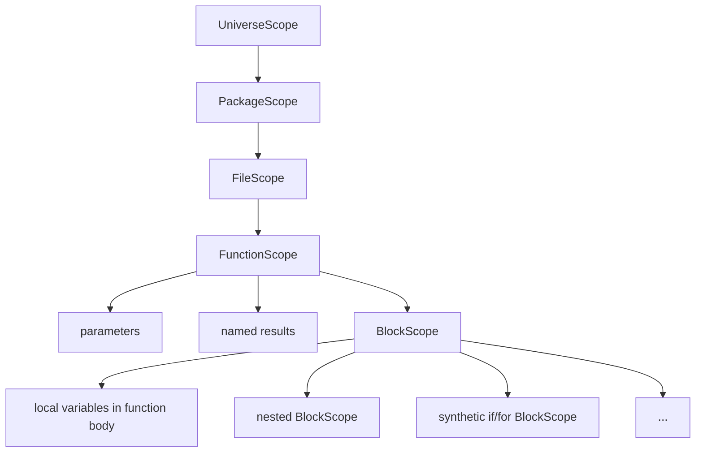

# Go programming language features supported by Gane

> [!CAUTION] V0 LANGUAGE SUBSET
>
> Gane V0 implements only a small subset of Go. Parsing a construct does not mean it can be compiled.

This document describes the current V0 implementation, from source text to LLVM IR. The parser recognizes more Go syntax than sema accepts, and some expressions that pass sema still fail during IR lowering. Unless stated otherwise, "supported" below means that valid source can pass the entire pipeline. For Go's language rules, see the [Go Programming Language Specification](https://go.dev/ref/spec).

## Target of V0

The goal of V0 is a minimal path from a `.go` file to `.ll` LLVM IR, not broad Go compatibility. The current CLI compiles one source file; sema itself can analyze multiple parsed files in one package.

## Table of Contents

- [Lexical Elements](#lexical-elements)
- [Types](#types)
- [Declaration and Scope](#declaration-and-scope)
- [Expression and Constant](#expression-and-constant)
- [Statement and Control Flow](#statement-and-control-flow)
- [Pre-declaration and Built-in Functions](#pre-declaration-and-built-in-functions)
- [Package and Initialization](#package-and-initialization)
- [Runtime and Backend Practice](#runtime-and-backend-practice)

## Lexical Elements

Go 1.27.0 is the normative reference for lexical rules. This section describes Gane's implementation. Scanner/parser support means that source text can be tokenized and represented in the AST; it does not imply that sema or IR V0 accepts the construct.

### Source Code Encoding

Like Go, Gane expects UTF-8 source. The scanner ignores an initial BOM and reports invalid UTF-8, NUL, or a BOM elsewhere as errors. Scanning and parsing may continue for error recovery and produce a partial AST; the driver does not proceed to semantic checking and IR lowering when parsing reports errors.

### Identifiers

Lexer will scan identifier using Unicode letter and decimal-digit categories, with `_` allowed as specified by Go. The Unicode category data comes from a Rust dependency [unicode-general-category](https://crates.io/crates/unicode-general-category). The exact difference is listed below:

1. **Letter**:
  - Go accepts but Gane rejects: 4644 code points
    - U+088F
    - U+0C5C
    - U+0CDC
    - U+A7CE..U+A7CF
    - U+A7D2
    - U+A7D4
    - U+A7F1
    - U+10940..U+10959
    - U+10EC5..U+10EC7
    - U+11DB0..U+11DDB
    - U+16EA0..U+16EB8
    - U+16EBB..U+16ED3
    - U+16FF2..U+16FF3
    - U+187F8..U+187FF
    - U+18D09..U+18D1E
    - U+18D80..U+18DF2
    - U+1E6C0..U+1E6DE
    - U+1E6E0..U+1E6E2
    - U+1E6E4..U+1E6E5
    - U+1E6E7..U+1E6ED
    - U+1E6F0..U+1E6F4
    - U+1E6FE..U+1E6FF
    - U+2B73A..U+2B73F
    - U+2CEA2..U+2CEAD
    - U+323B0..U+33479
  - Gane accepts but Go rejects: 0 code point
2. **Digit**:
  - Go accepts but Gane rejects: 10 code points
    - U+11DE0..U+11DE9
  - Gane accepts but Go rejects: 0 code point
3. **Print**:
  - Go accepts but Gane rejects: 4803 code points
    - U+088F
    - U+0C5C
    - U+0CDC
    - U+1ACF..U+1ADD
    - U+1AE0..U+1AEB
    - U+20C1
    - U+2B96
    - U+A7CE..U+A7CF
    - U+A7D2
    - U+A7D4
    - U+A7F1
    - U+FBC3..U+FBD2
    - U+FD90..U+FD91
    - U+FDC8..U+FDCE
    - U+10940..U+10959
    - U+10EC5..U+10EC7
    - U+10ED0..U+10ED8
    - U+10EFA..U+10EFB
    - U+11B60..U+11B67
    - U+11DB0..U+11DDB
    - U+11DE0..U+11DE9
    - U+16EA0..U+16EB8
    - U+16EBB..U+16ED3
    - U+16FF2..U+16FF6
    - U+187F8..U+187FF
    - U+18D09..U+18D1E
    - U+18D80..U+18DF2
    - U+1CCFA..U+1CCFC
    - U+1CEBA..U+1CED0
    - U+1CEE0..U+1CEF0
    - U+1E6C0..U+1E6DE
    - U+1E6E0..U+1E6F5
    - U+1E6FE..U+1E6FF
    - U+1F6D8
    - U+1F777..U+1F77A
    - U+1F8D0..U+1F8D8
    - U+1FA54..U+1FA57
    - U+1FA8A
    - U+1FA8E
    - U+1FAC8
    - U+1FACD
    - U+1FAEA
    - U+1FAEF
    - U+1FBFA
    - U+2B73A..U+2B73F
    - U+2CEA2..U+2CEAD
    - U+323B0..U+33479
  - Gane accepts but Go rejects: 0 code point

Most code points above are added in Unicode v17.0. It was the first time for the writing systems being introduced into Unicode. For more information, please look up the reference from Unicode Official.

To get the difference, you can run [the script](/tests/unicode-diff/compare.sh).

### Keywords and names

The keywords in Go will be recognized as keyword tokens, but names such as `true` and `false` are identifiers, not keywords, which is the same implementation like Go Compiler.

The keywords will be recognized in Lexer/Parser, and the corresponding Abstract syntax tree node will be generated, but the semantic and intermediate representation will reject some of the keywords in v0. More detailed information will be revealed in the following chapters.

### Semicolon

In Go Spec, Go programs omit semicolons using the following two rules:

1. When the input is broken into tokens, a semicolon is automatically inserted into the token stream immediately after a line's final token if that token is
   1. an identifier
   2. an integer, floating-point, imaginary, rune, or string literal
   3. one of the keywords, such as `break`, `continue`, `fallthrough`, or `return`
   4. one of the operators and punctuation, such as `++`, `--`, `)`, `]`, or `}`
2. A semicolon can also be omitted before a closing `)` or `}`.

In Gane, the semicolon omitting also satisfies the rule in Go Spec.

### Comment

In Gane, you can write comment like what you did in Go.

Single line comment and Multi-line comment are supported. However, there is no documentation generator in the Gane compiler, so non-instructional comments will be discarded when constructing the abstract syntax tree. 

And the instructional comments -- `//go:` and `//gane:` -- will be bound on the AST node next to them. `//line` instruction will affect source position like what it did in Go, which is implemented in Scanner of Gane.

### Operators and punctuation

The scanner recognizes Go operators and punctuation, but a recognized token does not guarantee that its expression or statement is supported. See [Expression and Constant](#expression-and-constant) and [Statement and Control Flow](#statement-and-control-flow) for more information.

### Literal

Literal support is intentionally narrower than the scanner and parser support. The scanner and parser recognize all of Go's basic literal token kinds, but the v0 semantic analyzer and IR lowering only implement integer values.

| Literal kind       | Scanner/parser | Sema/IR v0                     |
| ------------------ | -------------- | ------------------------------ |
| Integer            | Supported      | Partially supported; see below |
| Floating-point     | Supported      | Not supported                  |
| Imaginary          | Supported      | Not supported                  |
| Rune/character     | Supported      | Not supported                  |
| Interpreted string | Supported      | Not supported                  |
| Raw string         | Supported      | Not supported                  |

A non-integer `BasicLit` is rejected by the semantic analyzer with `non-integer literal`. The check is in `crates/sema/src/checker.rs`, in `check_expr`, rather than in the scanner. This means that a source file can parse successfully and still be rejected during semantic analysis or IR lowering.

#### Supported integer syntax

The semantic constant parser currently evaluates only decimal and `0x`/`0X` hexadecimal forms. Valid underscore separators are accepted because they are removed before conversion.

1. Decimal numbers:

   ```go
   0
   1
   42
   123456
   1_000_000
   ```

2. Hexadecimal numbers with a `0x` or `0X` prefix:

   ```go
   0x0
   0x2a
   0x2A
   0xffff
   0x_FF
   ```

The implementation is `parse_array_length` in `crates/sema/src/checker.rs`. Despite its name, it is also used to obtain the constant value of ordinary integer expressions.

#### Unsupported or incorrectly interpreted integer syntax

The scanner recognizes more integer forms than the semantic constant parser can evaluate:

- Binary prefixes (`0b` and `0B`) are not handled by Sema.
- Explicit octal prefixes (`0o` and `0O`) are not handled by Sema.
- A legacy leading-zero literal such as `052` is accepted by the scanner, but is interpreted as decimal `52`, not Go's octal value `42`.
- A malformed legacy-octal literal such as `078` is rejected earlier by the scanner as an invalid octal literal.

The scanner-side validation and diagnostics are implemented in `scan_number` in `crates/parser/src/scanner/scanner_impl.rs`. The missing binary/octal evaluation is caused by `parse_array_length`, which only strips `0x` and `0X` and treats every other form as decimal.

#### Numeric bounds

The first conversion boundary is an unsigned 64-bit value because the semantic parser uses `u64::from_str_radix`. Therefore, the directly representable range is:

```text
0 ..= 18446744073709551615
```

or, in hexadecimal:

```text
0 ..= 0xffffffffffffffff
```

A literal larger than this range, such as the following, cannot be converted by the semantic constant parser:

```go
18446744073709551616
0x10000000000000000
```

For array lengths, conversion failure is reported by `resolve_type_expr` in `crates/sema/src/checker.rs` as an unsupported MVP array length. For ordinary expressions, an invalid or unavailable constant can instead be reported later by IR lowering because the current `TypeAndValue` has no usable constant value.

There is a second, target-dependent boundary when an integer constant is lowered to IR:

- On a 32-bit target, `int` must fit in `-2^31 ..= 2^31-1`.
- On a 64-bit target, `int` must fit in `-2^63 ..= 2^63-1`.
- `byte` must fit in `0 ..= 255`.

These checks are in `crates/ir/src/lower/types.rs`, in `lower_constant`. Values outside the target type's range result in `InvalidConstant` during IR lowering. A negative integer is represented as a unary minus applied to a positive integer literal, so its final signed range is checked during lowering rather than by the scanner.

#### Array-length-specific restrictions

Array lengths are more restricted than ordinary integer expressions. In the current v0 implementation, `[N]T` requires `N` to be a directly parseable integer literal in the supported decimal/hexadecimal subset. The following are not supported as array lengths:

```go
const count = 3
var a [count]int       // named constant is not accepted
var b [1+2]int         // constant expression is not accepted
var c [...]int         // inferred length is not accepted
var d [0b10]int        // binary form is not evaluated
```

A zero-length array is also rejected by Sema, even though the literal `0` itself is valid:

```go
var values [0]int
```

The diagnostic is `zero-length arrays are not supported by IR V0`. Finally, IR lowering requires an array length to fit the target pointer-width unsigned integer; on a 32-bit target, an otherwise valid positive length larger than `u32::MAX` is rejected during lowering.

## Types

### Basic types

The types below are supported in v0 design:

- `int`: Gane keeps `int` as the source-level type. During lowering, its IR representation is `I32` when the target pointer width is 32 bits and `I64` when it is 64 bits. So, `int` ranges from `-2^31..=2^31-1` and `-2^63..=2^63-1`.
- `bool`: Lowered to IR `I1`, used for boolean values and conditions.
- `byte`: Lowered to IR `I8`. In Go, `byte` is an alias for `uint8`; in current Gane sema, `byte` is represented as its own basic type.

> [!WARNING] 
> 
> `byte` is not the alias for `uint8`. In v0 design, there is not a source-level type named `uint8`.

The unsupported ones:

- `uint`, `uint8`, `int8`, `int32`, `int64` and other integer types are not supported.
- `float32`, `float64`, `complex32`, `complex64` are not supported.
- `rune` and `string` are not supported.
- `unsafe.Pointer` are not supported.
- `void` is the internal reserved type and not the user-available type.

### Pointers

Supported when `T` is a type supported by the current Gane subset. The pointer width follows the target pointer width. IR V0 uses address space `0`.

The support detail:

- Pointer variable
- Address-of operation `&a`
- Dereference operation `*p`
- Pointer field access `p.Field` or `(*p).Field`
- Recursive pointer
- Null pointer values from global pointer initialization and ordinary zero initialization
- Pointer comparison between pointer expressions other than the `nil` literal

The non-support detail:

- The pointer for unsupported types
- `&` composite literals
- Pointer calculation
- Unsafe pointer
- `nil` as a general expression in local initializers, returns, or comparisons

The semantic checker currently lets `p == nil` and `p != nil` pass, but IR lowering cannot materialize the `nil` literal as an expression-level null constant. These comparisons are not supported end to end. Sema's treatment of `nil` is also too permissive: its invalid placeholder type can let other, non-Go-valid comparisons pass type checking. Do not treat sema acceptance here as a correct pointer-comparison rule.

### Arrays

Supported for non-zero lengths that the current sema/lowering path can represent.

- Zero-length arrays are rejected:
  ```go
  package main

  var values [0]int

  func main() {}
  ```
  Sema reports `E2102` (`zero-length arrays are not supported by IR V0`).

- Array lengths must currently be a directly parseable integer literal. Constant names, arithmetic expressions, and inferred lengths (`[...]T`) are not supported. The helper parses decimal and `0x`/`0X` hexadecimal forms into `u64`; binary/octal prefixes are not handled, and a legacy leading-zero octal literal is currently interpreted as decimal. Thus this is a Gane subset, not Go-correct handling of every integer-literal base.

- The IR lowering also requires the length to fit the target pointer-width unsigned integer.

For example, this is valid Go syntax but its constant-expression length is not supported by Gane:

```go
package main

const count = 3
var values [count]int

func main() {}
```

Array-length inference also uses valid Go syntax, but is unsupported by Gane (the sema may report both the unsupported inferred length and the non-empty composite literal):

```go
package main

func main() {
    var values = [...]int{1, 2, 3}
}
```

### Structs

Non-empty structs with explicitly named fields are supported, provided each field type is supported.

Both anonymous struct types and named defined struct types are supported. Named-type identity is checked by sema; IR lowering uses the underlying representation.

Empty struct type, embedded fields, and field tags are not supported by the current v0. Duplicate field names are rejected.

Meanwhile, struct in v0 allow recursion, but only recursive by pointer not value.

```go
type Node struct {
  next *Node
}
```

Anonymous struct example:

```go
package main

func main() {
    var value struct {
        a int
        b int
    }
    value.a = 1
    value.b = 2
}
```

Named struct example:
```go
package main

type Person struct {
    age int
}

func main() {
    var person Person
    person.age = 18
}
```

### Composite literals

Empty aggregate composite literals with an explicit type are supported, for example `Pair{}` (The premise is that the struct is not an empty field struct) and `[2]int{}`. 

Non-empty composite literals are not supported. Keyed elements (`key: value`) are also not supported. These are valid Go syntax, but Gane sema reports unsupported-feature diagnostics (`E2405`):

```go
package main

type Pair struct {
    value int
}

func main() {
    var pair Pair = Pair{value: 1}
    var values [2]int = [2]int{1, 2}
}
```

Taking the address of a composite literal, or directly selecting a field/indexing a composite literal, is also unsupported, including for empty aggregate literals.

### Named types and underlying types

A declaration of the form `type Name T` creates a distinct named type. The named type keeps its own identity in Sema even when its underlying type is the same as another type:

```go
type UserID int
type Counter int

var user UserID
var count Counter
```

`UserID`, `Counter`, and `int` are distinct semantic types. They are not interchangeable by ordinary assignment merely because they have the same underlying representation. During IR lowering, however, supported named types are represented using their underlying type. For example, a named `int` lowers to the target-dependent integer type, and a named struct lowers to the corresponding IR struct type.

A named type may refer to another supported type and may be recursive through a pointer:

```go
type Node struct {
    next *Node
    value int
}
```

A recursive value type without pointer indirection is rejected because it would have an infinite size:

```go
type InvalidNode struct {
    next InvalidNode
}
```

Sema reports `invalid recursive type: cycle requires pointer indirection`. The recursion check is performed while resolving named types in `crates/sema/src/checker.rs`.

Type aliases are not supported. The parser recognizes the syntax, but Sema reports `type alias` for declarations such as:

```go
type Alias = int
```

Generic type declarations and type parameters are also not supported:

```go
type Set[T comparable] struct {
    value T
}
```

Named-type resolution and underlying-type lookup are implemented in `crates/sema/src/checker.rs`. The corresponding IR type representation and type caching are handled in `crates/ir/src/lower/types.rs`.

### Summary for unsupported types

The parser recognizes many Go type forms, but recognition by the parser does not imply semantic or IR support. The v0 semantic analyzer rejects type forms that do not have a supported type representation and lowering path.

| Type form                                 | Gane v0 status                  | Notes                                                                                                                                                                       |
| ----------------------------------------- | ------------------------------- | --------------------------------------------------------------------------------------------------------------------------------------------------------------------------- |
| `bool`, `int`, `byte`                     | Supported                       | These are the available source-level basic types.                                                                                                                           |
| `*T`                                      | Partially supported             | `T` must be supported. Addressing variables, dereference, pointer field access, zero/null pointer values are supported. Pointer equality between pointer expressions is supported, but comparisons with the `nil` literal are currently sema-only; pointer arithmetic and ordering are not.         |
| `[N]T`                                    | Partially supported             | `N` must be a supported direct integer literal and must be non-zero; see the Arrays section.                                                                                |
| `struct { ... }`                          | Partially supported             | Named fields and supported field types are required. Empty structs, embedded fields, and tags are rejected.                                                                 |
| Named defined types                       | Supported                       | The named type has distinct Sema identity, and its underlying type must be supported.                                                                                       |
| Type aliases (`type A = T`)               | Not supported                   | Sema reports `type alias`.                                                                                                                                                  |
| Slices (`[]T`)                            | Not supported                   | Slice types and slice expressions are not implemented.                                                                                                                      |
| Maps (`map[K]V`)                          | Not supported                   | Map types and map operations are not implemented.                                                                                                                           |
| Interfaces (`interface{...}`)             | Not supported                   | Interface types, method sets, assertions, and type switches are not implemented.                                                                                            |
| Channels (`chan T`)                       | Not supported                   | Channel types and channel operations are not implemented.                                                                                                                   |
| Function types (`func(...) ...`)          | Not supported as ordinary types | Function declarations may use supported parameter/result signatures, but function types as variables, fields, or named underlying types are not part of the v0 type subset. |
| Type parameters and generic instances     | Not supported                   | Type parameter declarations, constraints, and instantiated types are rejected.                                                                                              |
| `unsafe.Pointer` and other Go basic types | Not supported                   | Only `bool`, `int`, and `byte` are pre-declared source-level basic types.                                                                                                    |

Unsupported type expressions are generally diagnosed while resolving a type expression in `crates/sema/src/checker.rs`. Target-dependent limits and the lowering of supported types are handled in `crates/ir/src/lower/types.rs`.

## Declaration and Scope

The scopes are planned like below which is the same as Go Compiler Design:



The current CLI accepts one source file at a time. This is a driver/package-loading limit, not a parser or sema limit: callers can parse multiple files with the same `FileSet` and pass their ASTs to sema as one package. The CLI does not yet load a package from a directory, resolve imports, or combine source files automatically.

Top-level declarations are stored in the shared package scope, even when semantic analyzes several files.

### Scope Creation Process

Scope creation is performed by the semantic checker. It will create scopes in following steps:

1. Validate the package clause
2. Create the universe scope and declare pre-declared objects
3. Create one package scope for analyzed package
4. Create one file scope for each source file inputted
5. Collect all top-level declarations into the package scope
6. Create function scope when function signatures are resolved
7. Create block scope when function bodies are checked

### Universe Scope

The universe scope contains names that are available to every package without an explicit declaration. It is the root scope of the semantic scope tree.

The current V0 implementation declares:

| Name | Kind | Description |
|---|---|---|
| `bool` | pre-declared type | Boolean type |
| `int` | pre-declared type | Integer type |
| `byte` | pre-declared type | Byte type |
| `true` | pre-declared constant | Boolean constant |
| `false` | pre-declared constant | Boolean constant |
| `nil` | pre-declared value | Nil value |

The internal `void` type is also created by the type system, but it is not declared as a source-level name in the universe scope.

Most Go pre-declared types and built-in functions are not implemented in V0.

### Package Scope

The package scope represents the package block of the analyzed package. It is created as a child of universe scope and is shared by all the source files belonging to the package.

Package scope will be created after package clause check and universe scope creating.

All the top-level declaration will be put at this layer. In v0 design, there will be four types of declarations:

1. Global variable
2. Global constant
3. Function
4. Type declaration

Global variables have either a supported scalar constant initializer or a zero initializer; an explicit `nil` pointer initializer also becomes a zero/null initializer. Runtime expressions (such as calls or variable reads) and explicit aggregate initializers are rejected by sema. Package-level constants are checked and folded separately.

### File Scope

Every analyzed input file has its own file scope. Currently it has no file-local declarations because imports are unsupported, but type resolution, function scopes, and global initializers still use the appropriate file scope as their lookup starting point. Top-level declarations are stored in the shared package scope. File scopes also provide the intended place for future file-local import names.

### Function Scope

Function scope is the child of File scope, but the function name is still belonging to Package scope as a `FuncDecl`.

Function scope contains:

- Named parameters
- Named result variables
- Body block scopes

In the procession of top-level declaration, the functions will be interpreted at the every place of being declared. 

Semantic checker will do first:

1. Check receiver
2. Check generic
3. Check whether there is a function body
4. Create an empty function signature
5. Put the function declaration into package scope
6. Save they to `func_decl`

Therefore, semantic checker give the capability to the language using the function even having been declared in priority.

After the type resolving and global object collecting, the function bodies will be processed. 

You can declare variable in function body. They will be parsed as declaration statement. Then, they will be saved as StackSlot in Gane IR, and finally become a store instruction in LLVM IR with the initial value of const zero. The variables with ScalarInitializer will be initialized at the declared places.

A local `var` declaration is represented by a declaration statement in the AST. Its object is inserted into the current Block scope. A declaration in the function body therefore belongs to the function body's outer Block scope, while a declaration inside a nested block belongs to that nested Block scope.

Local variables do not enter Function scope. Function scope is reserved for parameters and named result variables.

But you can not declare a constant in function. Because in v0, local `const` and local `type` declarations are parsed by the parser but are rejected by sema. The checker currently accepts only local `var` declarations. It will report error: `local declaration is not supported by the MVP`. Meanwhile, short variable declaration (`:=`) are also parsed but rejected by sema as an unsupported MVP feature.

### Block Scope

Gane creates a `BlockScope` for the function body and every nested block. The checker also uses `ScopeKind::Block` for the implicit scopes of `if` and `for` statements. By the way, there is no `IfScope` or `ForScope` kinds in v0 design.

Local `var` declarations are inserted into the current `BlockScope`. Parameters and named result variables belong to the enclosing `FunctionScope`. Name lookup walks through parent scopes, so an inner declaration may shadow an outer one, while duplicate declarations in the same scope are rejected.

As in Go, a local variable is not visible in its own initializer. That is because the initializer and explicit type are checked before the declaration is inserted.

The following local declarations are parsed but rejected by v0 sema:

- local `const` declarations
- local type declarations
- short variable declarations

Block scope are semantic scopes only. During IR lowering, local variables become function-level `StackSlot`s. Block scope does not directly represent runtime stack lifetime.

## Expression and Constant

The parser recognizes more Go expression forms than the v0 semantic checker and IR lowering pipeline can support. An expression is part of the Gane v0 language only when it passes semantic checking and can be represented by v0 IR.

### Supported expression forms

| Expression | Gane v0 status | Notes |
| --- | --- | --- |
| Integer literals | Partially supported | Decimal and hexadecimal forms are supported. See [Literal](#literal) for more information. |
| `true` and `false` | Supported | They are pre-declared boolean constants, which is the same as Go's implementation. |
| Identifiers | Supported | - |
| Parenthesized expressions | Supported | - |
| Unary `+` and `-` | Supported | The operand must have an integer type. |
| Unary `!` | Supported | The operand must have type `bool`. |
| Address-of `&x` | Partially supported | `x` must be addressable. Taking the address of a composite literal is not supported. |
| Pointer dereference `*p` | Supported | The operand must be a pointer to a supported type. Dereferencing a null pointer traps (`NullDereference`) at runtime. |
| Arithmetic `+`, `-`, `*`, `/`, `%` | Supported | Operands must be integers with compatible types. Division and remainder by trap (`DivisionByZero`) at runtime. |
| Integer comparisons `<`, `<=`, `>`, `>=` | Supported | Only integer operands are supported. |
| Equality `==` and `!=` | Partially supported | Boolean, integer, byte, and pointer expressions can be compared. Aggregate values are not comparable. Comparisons with the `nil` literal pass sema but are not yet able to be lowered to IR. |
| Boolean `&&` and `\|\|` | Supported | Evaluation is short-circuiting. |
| Function calls | Partially supported | Direct calls have a fixed number of scalar arguments and may return zero or one scalar result. Variadic calls, function values, built-ins, and methods are not supported. A value-returning call used alone as a statement passes sema but fails IR lowering. |
| Array indexing | Supported | Only fixed-size arrays are supported. The index must be an `int` or `byte`. Bounds are checked at runtime. |
| Struct field selection | Supported | Direct fields and one-level pointer-indirect fields are supported. Embedded fields, promoted fields, and methods are not supported. |
| Empty aggregate literals | Partially supported | Explicit empty literals such as `Pair{}` and `[2]int{}` are supported as zero aggregate values. Non-empty and keyed literals are not supported. |

The following expression forms are not supported by the v0 semantic or IR pipeline:

- floating-point, imaginary, rune, and string expressions;
- bitwise and shift operators;
- channel receive expressions;
- function literals;
- slice expressions;
- map, slice, interface, and channel operations;
- type assertions;
- generic index lists;
- explicit type conversions;
- non-empty or keyed composite literals;
- method values and method expressions.

The parser may still construct AST nodes for these forms. They are rejected later by semantic checking or IR lowering.

### Expression value categories

Gane's semantic checker records more than the type of an expression. It also records how the expression can be used:

- A **value** can be used as an operand, initializer, return value, or argument.
- A **variable** is addressable and can be used as an assignment target. Variables, parameters, dereferences, array elements, and struct fields can produce this category.
- A **nil value** is the pre-declared `nil` value. It does not have an ordinary source-level pointer type and cannot be used to infer the type of a variable. In the current implementation, it is fully able to be lowered only in global pointer initialization, using it as an ordinary expression is not yet supported by IR lowering.
- A **no-value expression** is produced by a function call with no result. It can only be used as a statement.
- An invalid expression is retained for error recovery but cannot be lowered.

The code implementation about this is located at [`TypeAndValue`](/crates/sema/src/types.rs).

Gane v0 uses exact type identity for assignment and operator checking. It does not implement Go's full implicit conversion and assignability rules. In particular, integer literals have semantic type `int`, rather than an untyped integer constant. Therefore, the following assignment is currently rejected:

```go
var value byte = 1
```

`byte` is also a distinct Gane source type in v0; it is not treated as an alias for another source-level integer type.

### Constants and constant expressions

Gane v0 implements a smaller and more concrete constant model than Go. Only package-level constant declarations are supported. Local `const` declarations are parsed but rejected by semantic analysis.

The supported constant value kinds are:

- boolean constants;
- integer constants.

String, rune, floating-point, imaginary, and complex constants are not supported. Gane v0 also does not implement `iota`.

A constant may refer to another package-level constant, including a constant declared later in the source file:

```go
const base = 2
const limit = base + 3
var value int = limit
```

The semantic checker folds supported constant expressions when all operands have known constant values. The currently folded operations include:

- unary `+` and `-` on integer constants;
- integer `+`, `-`, `*`, `/`, and `%`;
- integer comparisons;
- equality comparisons between known constants;
- boolean `&&` and `||`.

Constant folding is narrower than expression checking. For example, boolean negation is a valid runtime expression, but it is not currently folded into a `ConstValue`. Bitwise operators, shifts, calls, indexing, field selection, and other runtime-dependent expressions are not constant expressions in v0.

A folded constant is not automatically accepted in every Go constant context. Array lengths are a current example: Gane v0 requires an array length to be a directly parseable integer literal. Consequently, both of the following forms are rejected as array lengths, even though Go accepts them:

```go
var values [1 + 2]int

const count = 3
var other [count]int
```

See [Array-length-specific restrictions](#array-length-specific-restrictions) for the current array rules. See [Checker.rs `fn fold_*`](/crates/sema/src/checker.rs) for more detailed implementations about folding. 

For global variables, v0 accepts only initializers that can be represented as a scalar constant, a null pointer, or a zero initializer. A runtime expression such as a function call or an address computation cannot be used as a global initializer.

### The `nil` comparison limitation

The semantic checker currently lets a pointer comparison such as this pass:

```go
var pointer *int

func main() {
    if pointer == nil {
    }
}
```

However, this source is not yet supported end to end. The expression `pointer` is lowered as a pointer value, while `nil` is represented by sema as a special `ValueMode::Nil` without a source-level pointer type. The lowering path has no case that converts this expression-level `nil` into an IR `Constant::Null`. As a result, the source produces no semantic diagnostic but fails during IR lowering.

Pointer equality between two ordinary pointer expressions, such as `left == right`, is supported. The missing lowering case is the `nil` operand. There is also a separate sema bug: because `nil` has an invalid placeholder type and invalid types suppress assignment errors, sema may accept comparisons that Go would reject, such as `1 == nil`. Such expressions are not supported and should not be used.

### Runtime behavior

Several expressions require runtime checks in the v0 IR:

- `&&` and `||` preserve short-circuit evaluation;
- division and remainder check for division by zero;
- array indexing checks for negative and out-of-range indexes;
- pointer dereference and pointer field access check for null pointers.

These checks are represented in the IR as guarded operations or traps rather than as unchecked LLVM operations. On a failed check, the LLVM backend calls its `__gane_trap` helper, which invokes `llvm.trap()`.

## Statement and Control Flow

Gane v0 parses the Go statement syntax broadly, but accepts only the subset that can be represented by the current semantic checker and IR. A parsed statement is not necessarily part of the executable Gane v0 language.

Gane v0 supports block statements, local var declarations, simple assignment, self-increment and self-decrement, if, conditional and infinite for loops, unlabeled break and continue, direct calls with no result, and return with zero or one scalar result. Function signatures can name result variables, but a function with a result still requires an explicit return expression. Bare `return` is not currently accepted.

| Go construct | Gane v0 difference |
| ------------ | ------------------ |
| Local declarations | Only local var declarations are accepted. Local constants, local type declarations, and short declarations are rejected. |
| Assignment | Only ordinary (`=`) assignment is supported. Compound assignments (`+=` etc.) are rejected. Blank assignment (`_ = expression`) discards the result but still checks and evaluates the expression. A no-value expression cannot be assigned to `_`. |
| Expression statements | See [Expression Statements](#expression-statements) for details. |
| `if` | The condition must have the type `bool`. Go-style initializer statements in `if` are parsed but rejected. |
| `for` | Only `for condition { ... }` and `for { ... }` are supported. Three-clause loops and range loops are rejected. |
| Branches | Only unlabeled break and continue inside a `for` loop are supported. `goto`, `label`s, `fallthrough`, and labeled branches are rejected. |
| Selection and concurrency | `switch`, type switch, `select`, channel send, `go`, and `defer` are parsed but rejected. Gane v0 therefore has no Go concurrency or deferred-call semantics. |

### Expression Statements

End to end, only direct no-result function calls are supported as expression statements. Sema accepts a broader shape than IR lowering: it recognizes parenthesized calls as call statements and does not reject an unused result, while IR lowering requires the statement expression itself to be a direct `CallExpr` with no result.

For example,

```go
func foo() {}

func main() {
  foo() // Supported
}
```

`foo()` satisfies four conditions: 

- `foo()` is a direct function calling
- `foo() {}` is a top-level function declaration
- `foo() {}` has no return
- The result from `foo()` has no need to be consumed

The situations below are not supported:

1. Function with a result

```go
func foo() int {
  return 1
}

func main() {
  foo() // Sema accepts this; IR lowering rejects the unused result
}
```

You should write in this way:

```go
func main() {
  _ = foo() // Use _ for explicitly abandoning the return
}
```

2. Function variables
  
```go
func main() {
  var f func()
  f() // Unsupported
}
```

Calls must name a package-level function directly. Function types as variables and calls through function values are not supported.

3. Method calling

The implementation currently doesn't fully support method sets, receivers, method values, or method expressions.

4. Builtin function

The implementation currently doesn't fully support builtin mechanism.

### Scope and control-flow semantics

As in Go, each block introduces a lexical scope and inner declarations may shadow outer declarations. A local variable is not visible in its own initializer. Gane additionally creates semantic block scopes for `if` and `for` statements, but these scopes do not imply a separate runtime stack lifetime: local variables in `if` and `for` scopes will be lowered to function-level stack slots in v0.

The checker validates boolean loop and conditional guards, valid branch placement, return arity, and exact result-type compatibility before IR lowering. It also records whether a statement guarantees termination. In particular, an unconditional `for` without a reachable break is treated as non-`fallthrough`.

Lowering preserves source-order side effects. Conditions and short-circuit boolean operations become explicit control-flow graph branches rather than ordinary eager binary operations. Runtime checks (such as null-pointer, array-bounds, and division-by-zero checks) must occur before the operation they protect and must not be moved across earlier side effects.

## Pre-declaration and Built-in Functions

Gane v0 creates a universe scope containing a minimal set of pre-declared names: `bool`, `int`, `byte`, `true`, `false`, and `nil`. The internal `void` type is used to represent functions without results, but is not exposed as a source-level name. This is substantially smaller than Go's universe scope.

Pre-declared names are resolved before package declarations and can be shadowed by declarations in nested scopes. `nil` is modeled as a special value rather than as an ordinary pointer type, and therefore cannot be used to infer a variable's type.

Gane v0 does not yet implement Go built-in functions such as `len`, `make`, `new`, `append`, or `panic`. Their syntax may be parsed, but calls are rejected by the semantic checker or IR lowering. The builtin object category is reserved for future language extensions and does not currently provide callable builtin values.

## Package and Initialization

The CLI compiles a single source file as `package main` and requires `func main()` with no parameters or results. Sema can analyze several AST files belonging to the same package, but the CLI does not load a directory or resolve imports. `import` declarations are parsed and rejected by sema; there is no package graph or standard-library integration.

Package-level names can refer to later declarations, subject to initialization-cycle checks. There is no runtime package-initialization pass: global variables can use zero values, supported scalar constants, or `nil` for pointer globals, but not calls, address computations, or explicit aggregate initializers (even empty ones). Local variables are initialized when execution reaches their declaration; all stack slots have zero values on function entry.

## Runtime and Backend Practice

Gane v0 does not provide Go runtime compatibility. It has no garbage collector, goroutines, channels, maps, reflection, or standard-library runtime. The executable model is intentionally small: programs use statically known types, function calls, stack slots, globals, and explicit memory operations.

The compilation pipeline is:

```mermaid
flowchart TD
  A[Source] --> B[Lexer/Parser]
  B --> C[Semantic Analysis]
  C --> D[Gane IR]
  D --> E[IR Verification]
  E --> F[Interpreter]
  E --> G[LLVM Code Generator]
```



The semantic checker resolves names and types before lowering. The IR verifier then checks the structural and type invariants required by both execution paths. Neither the interpreter nor the backend is allowed to redo source-level name lookup or type inference.

### Runtime checks and traps

Operations that may be invalid at runtime are represented with explicit checks rather than relying on host-language undefined behavior. The current runtime checks include:

- null pointer dereference
- array bounds violations
- division or remainder by zero
- invalid integer division cases
- invalid shift counts in IR (source-level shift operators are not supported in V0)
- dangling stack-pointer access in the interpreter (Only used for test, static escape detection was given up in v0)

A failed check produces a Gane trap. Traps terminate the current execution. V0 does not provide recovery, deferred cleanup, or Go-style panic handling.

The interpreter uses structured values and memory objects, so it does not need to reproduce the physical layout of a target machine. It nevertheless follows the same IR-level behavior as the LLVM backend, including zero initialization, evaluation order, memory effects, and traps.

### LLVM backend

The LLVM backend lowers only verified IR. It obtains target-dependent facts such as pointer width, data layout, field offsets, and alignment from the host LLVM Target Machine and Target Data. Gane does not duplicate LLVM's layout algorithm.

Gane source types are represented by their underlying IR representation. For example, a source-level named integer type keeps its semantic identity during type checking but uses an integer representation in IR. Local variables are lowered to stack slots, and control-flow constructs are lowered to explicit LLVM basic blocks and branches.

The backend currently targets LLVM IR generation rather than full Go-compatible execution. It emits a hosted main wrapper and internal trap support, but Gane v0 does not yet provide a Go runtime, automatic linking, or a complete standard library. Interpreter and LLVM execution are tested against the same verified IR so that normal results and trap behavior remain consistent.
